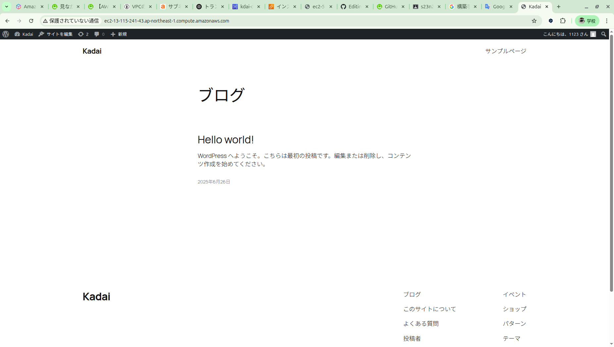

# S23009 小濱悠斗

## 問1 host1のネットワークアドレス，IPアドレス，ルーティングテーブルを答えよ
                192.168.10.64/26,   IP(192.168.10.70)  192.168.10.75 
## 問2 router1のネットワークアドレス，IPアドレス，ルーティングテーブルをすべて答えよ
            host1:192.168.10.64/26    IP(192.168.10.75)  
          router2:192.168.10.128/26   IP(192.168.10.130) 192.168.10.129
## 問3 router2のネットワークアドレス，IPアドレス，ルーティングテーブルをすべて答えよ
          router1:192.168.10.128/26,  IP(192.168.10.129) 192.168.10.130
            host2:192.168.10.192/26,  IP(192.168.10.200) 
## 問4 host2のネットワークアドレス，IPアドレス，ルーティングテーブルを答えよ
                192.168.10.192/26,  IP(192.168.10.201) 192.168.10.200

# 問５ Wordpress構築手順書 (AWS)
## 前提条件
- リージョン：東京(ap-northeast-1)
- CIDRブロック：192.168.10.0/24を8分割 /27にして使用
- PublicSubnet と PrivateSubnet は２つ構築する
- PrivateSubnet に RDSを構築

## VPCを作成 (kadai-vpc)
- CIDRブロック(192.168.10.0/24)

### サブネットを作成 
- kadai-public-not-use-1  CIDRブロック(192.168.10.0/27)   AZ(ap-northeast-1a)
- kadai-private-DB-1      CIDRブロック(192.168.10.64/27)  AZ(ap-northeast-1a)
- kadai-public-use-2      CIDRブロック(192.168.10.32/27)  AZ(ap-northeast-1c)
- kadai-public-DB-YOBI-2  CIDRブロック(192.168.10.96/27)  AZ(ap-northeast-1c)

### インターゲートウェイを作成しVPCにアタッチ
- kadai-internet-gateway

### ルーティングテーブルを作成
- public-loot-table   (192.168.10.0/24), (0.0.0.0/0  IGWを設定)
- private-loot-table-1 (192.168.10.0/24)

### ルーティングテーブルをサブネットにつなげる
- public-loot-table → kadai-public-not-use-1, kadai-public-use-2
- private-loot-table-1 → kadai-private-DB-1, kadai-public-DB-YOBI-2

### EC2からインスタンスを作成
- kadai-fumidai-server  使用するサブネット(kadai-public-use-2), パブリックIPアドレス有効化, プライマリIP 192.168.10.40
- kadai-web-server      使用するサブネット(kadai-public-use-2), パブリックIPアドレス有効化, プライマリIP 192.168.10.45

### 各インスタンスのセキュリティグループの詳細
- fumidai-SG        ssh  ポート番号:22  0.0.0.0/0
- WEB-SG            ssh  ポート番号:80  192.168.10.40   HTTP ポート番号:80 0.0.0.0/0

## RDSの作成手順
### DBサブネットグループを作成
- kadai-DB-subnet  AZ(ap-northeast-1a, ap-northeast-1c), サブネット(kadai-private-DB-1, kadai-public-DB-YOBI-2)

### データベースを作成
- mariaDBで作成
- kdai-database-1
- マスターユーザーネームは admin
- EC2に接続しないを選択
- DBサブネットグループは kadai-DB-subnet
- セキュリティグループを新規作成 DB-SG  MYSQL/Aurora ポート番号:3306 192.168.10.45
- データベースの名前 kadai
- 作成したら kadai-web-server にセットアップ

## WordPressインストールまでー

### 踏み台サーバーにアクセス
- 踏み台サーバーに行く方法（ターミナルで打つ）
- ssh -i  (キーペアのパス)  ec2-user@(パブリックDNS名)
- 踏み台サーバーにキーペアをコピーする
- scp -i (キーペアのパス) (管理者としてのキーペアのパス) ec2-user@(パブリックDNS名):~/.ssh

### 踏み台サーバーからWEBサーバーにアクセス
-  ssh -i  (キーペアのパス)  ec2-user@(パブリックDNS名)

### WEBサーバーソフト（Apache）をインストールと起動
- sudo dnf -y install httpd
- sudo systemctl start httpd.service
#### サーバーが立ち上がると自動的にApacheが起動するようにする。
- sudo systemctl enable httpd.service

## RDSにつながるか確認
### MariaDBコマンドをインストール
- sudo dnf -y install mariadb105-server
### 接続のコマンド
- mysql [Database Name] -h [EndPoint] -P 3306 -u [UserName] -p

### WordPressのインストール手順
#### PHPをインストール
- sudo dnf -y install php8.1
#### PHPのライブラリをインストール
- sudo dnf -y install php8.1-mbstring php-mysqli
#### wordpressをダウンロード
- cd ~
- wget https://ja.wordpress.org/latest-ja.tar.gz
- tar xzvf latest-ja.tar.gz
- cd wordpress
- sudo cp -r * /var/www/html/
- sudo chown apache:apache /var/www/html -R
### Apachを再起動
- sudo systemctl restart httpd

## wordpressに接続する
- http://(パブリックDNS名)
- WordPress 初期設定ページが表示される
- DB名, ユーザー名, パスワード, DBホスト（RDSのエンドポイント）を入力
- 「インストール実行」→ WordPress ログイン画面へ

### ワードプレスのサイト名などを記入
- インストールを押しユーザー名とパスワードを入れると完了

