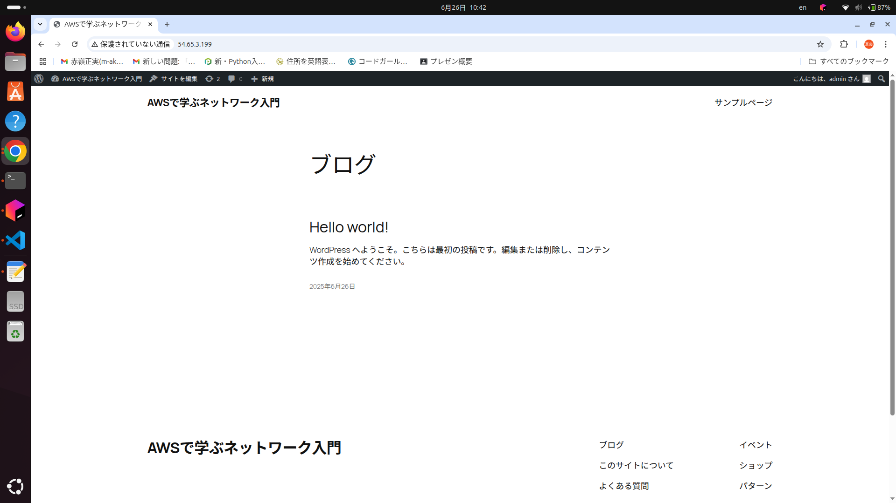

# ネットワーク設計・AWS構築課題
学籍番号：s23012
氏名：島袋 蒼良

---

## 問1: host1
- ネットワークアドレス: 192.168.10.64/26
- IP アドレス: 192.168.10.65
- ルーティングテーブル:
    - 192.168.10.64/26 -> 直結
    - 192.168.10.128/26 -> ゲートウェイ 192.168.10.66
    - 192.168.10.192/26 -> ゲートウェイ 192.168.10.66
    - デフォルト -> 192.168.10.66

---

## 問2: router1
- ネットワークアドレス:
    - host1側: 192.168.10.64/26
    - router2側: 192.168.10.128/26
- IP アドレス:
    - host1側インタフェース: 192.168.10.66
    - router2側インタフェース: 192.168.10.129
- ルーティングテーブル:
    - 192.168.10.64/26 -> 直結
    - 192.168.10.128/26 -> 直結
    - 192.168.10.192/26 -> ゲートウェイ 192.168.10.130
    - デフォルト -> 192.168.10.130

---

## 問3: router2
- ネットワークアドレス:
    - router1側: 192.168.10.128/26
    - host2側: 192.168.10.192/26
- IP アドレス:
    - router1側インタフェース: 192.168.10.130
    - host2側インタフェース: 192.168.10.193
- ルーティングテーブル:
    - 192.168.10.128/26 -> 直結
    - 192.168.10.192/26 -> 直結
    - 192.168.10.64/26 -> ゲートウェイ 192.168.10.129
    - デフォルト -> 192.168.10.129

---

## 問4: host2
- ネットワークアドレス: 192.168.10.192/26
- IP アドレス: 192.168.10.194
- ルーティングテーブル:
    - 192.168.10.192/26 -> 直結
    - 192.168.10.128/26 -> ゲートウェイ 192.168.10.193
    - 192.168.10.64/26 -> ゲートウェイ 192.168.10.193
    - デフォルト -> 192.168.10.193

---

## 問5: AWS構成
### サブネット
- PublicSubnet A: 192.168.10.0/27
- PrivateSubnet A: 192.168.10.32/27
- PublicSubnet B: 192.168.10.64/27
- PrivateSubnet B: 192.168.10.96/27

### 構成例
- PublicSubnet A: spring-table-server, my-web-server
- PrivateSubnet A: my-database
- PublicSubnet B: （予備）
- PrivateSubnet B: （予備）

### インスタンスセキュリティグループ

#### spring-board-SG

- 開放するサービス(port),開放するネットワーク
- ssh 0.0.0.0/0
#### My-Web-SG

- 開放するサービス(port),開放するネットワーク 
- ssh 192.168.10.5/32
- http    0.0.0.0/0
#### DB-SG

- 開放するサービス(port),開放するネットワーク 
- MySQL 192.168.10.4/32

### 構築手順
1. AWSでVPC (192.168.10.0/24)を作成。
2. 4つのサブネットを作成。
3. インターネットゲートウェイ(IGW)を作成し、VPCにアタッチしてから、Public Subnet A/Bへルート。
4. NATゲートウェイを配置し、Private Subnet A/Bからのインターネットアクセスを確保。
5. EC2インスタンスでWordPressを構築。
6. RDSインスタンスをPrivate Subnet Aへ配置。
7. セキュリティグループ、ルートテーブル、サブネットを関連付け。
8. ブラウザからWordPressへアクセス。

### スクリーンショット

