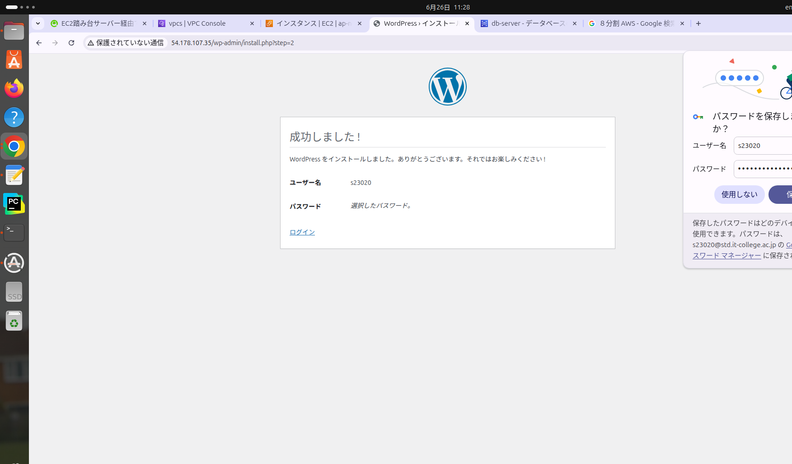
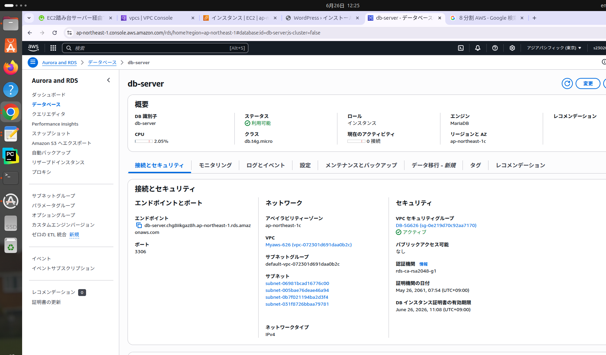

# AWS ネットワーク設計 - 回答

## 問1：host1

- **ネットワークアドレス**：10.0.0.32/27  
- **IPアドレス**：10.0.0.60 
- **ルーティングテーブル**：public-route-626

## 問2：router1

- **ネットワークアドレス**：10.0.0.32/27, 10.0.0.64/27  
- **ルーティングテーブル**：public-route-626

## 問3：router2

- **ネットワークアドレス**10.0.0.96/27  
- **ルーティングテーブル**：private-route-626A

## 問4：host2

- **ネットワークアドレス**：10.0.0.128/27
- **IPアドレス**: 10.0.0.70
- **ルーティングテーブル**：private-route-626B

AWS　ワードプレス構築手順
まずsshで踏み台サーバーにログインする。インパウンドルールはポート22　ソース0.0.0.0/->踏み台サバーからWebサーバーに入るためにmykeyをscpコマンドでもってくる。->Webサーバーにログインする。ポート範囲はsshの方は踏み台サーバーのIp　httpはすべて->アパッチをインストールし、起動を行うsudo dnf -y install httpd
sudo systemctl start httpd.service....->Phpとモジュールのインストール->wordpressのダウンロード->
Webのディレクトリにもってくる。->初期設定をする 名前wordpress ->ユーザー名admin　paswword,
データベースホスト,RDSで設定した。スクショ参照

## 9. スクリーンショット提出

以下は、WordPressの初期インストール画面のスクリーンショットです：

D
D

